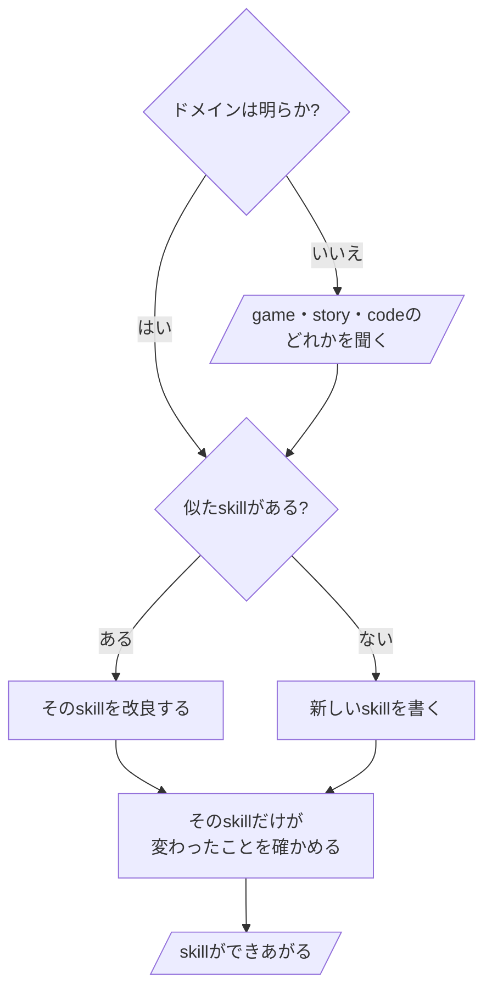

# create-skill

ユーザーが伝えた名前・用途・起動のきっかけから、このキットに新しいskillを作る。

平行四辺形はユーザーに見えて、答えるもの。

```mermaid
flowchart TD
  domain{ドメインは明らか?}
  domain -- "いいえ" --> ask[/"game・story・codeの<br/>どれかを聞く"/]
  domain -- "はい" --> similar
  ask --> similar{似たskillがある?}
  similar -- "ある" --> refine[そのskillを改良する]
  similar -- "ない" --> write[新しいskillを書く]
  refine --> confirm[そのskillだけが<br/>変わったことを確かめる]
  write --> confirm
  confirm --> done[/skillができあがる/]
```
