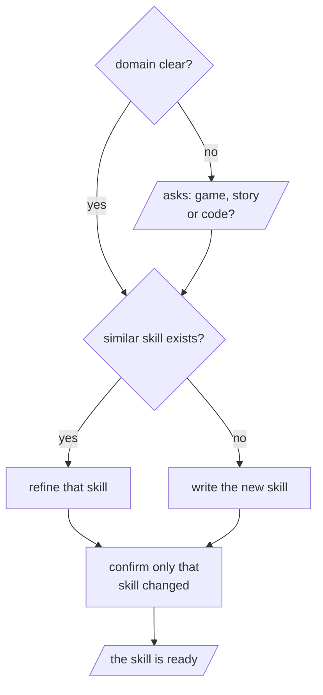

# create-skill

Scaffolds a new skill in this kit from the name, purpose and trigger the user gives.

Parallelograms are what the user sees and answers.

```mermaid
flowchart TD
  domain{domain clear?}
  domain -- "no" --> ask[/"asks: game, story<br/>or code?"/]
  domain -- "yes" --> similar
  ask --> similar{similar skill exists?}
  similar -- "yes" --> refine[refine that skill]
  similar -- "no" --> write[write the new skill]
  refine --> confirm[confirm only that<br/>skill changed]
  write --> confirm
  confirm --> done[/the skill is ready/]
```
