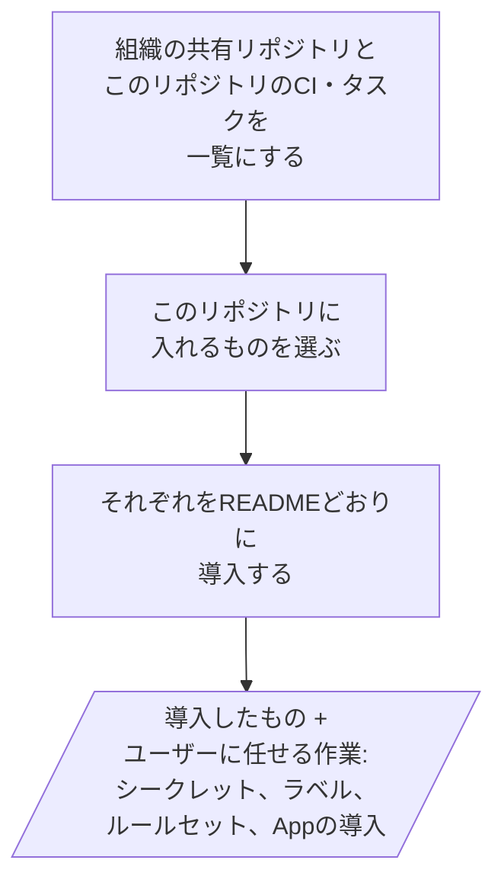

# automation

```mermaid
flowchart TD
  list[組織の共有リポジトリと<br/>このリポジトリのCI・タスクを<br/>一覧にする]
  list --> pick[このリポジトリに<br/>入れるものを選ぶ]
  pick --> install[それぞれをREADMEどおりに<br/>導入する]
  install --> done[/"導入したもの +<br/>ユーザーに任せる作業:<br/>シークレット、ラベル、<br/>ルールセット、Appの導入"/]
```
