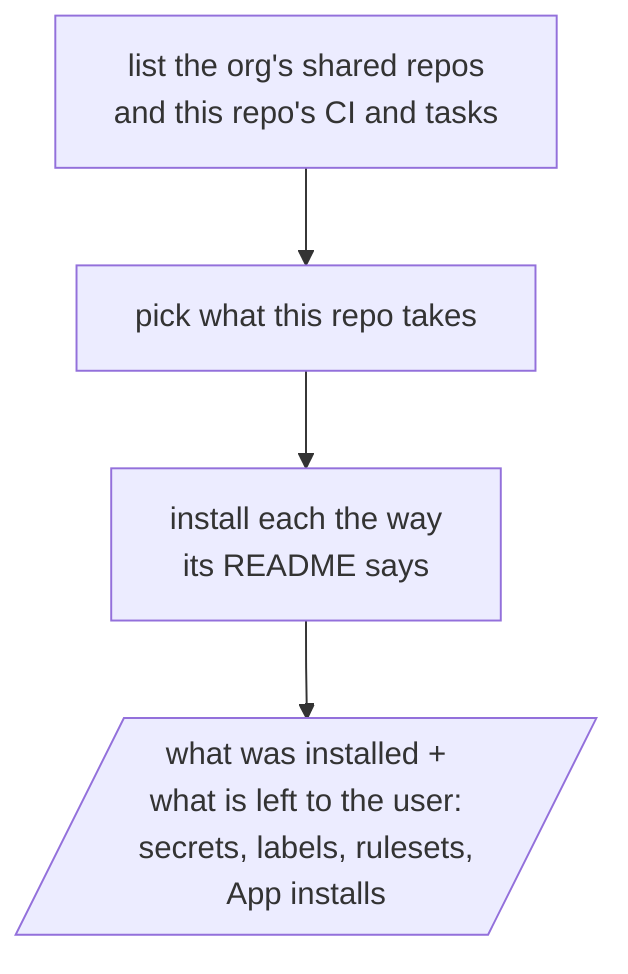

# automation

Sets up the org's shared GitHub Actions and configs in this repo, the way each shared repo's README says.

Parallelograms are what the user sees and answers.

```mermaid
flowchart TD
  list[list the org's shared repos<br/>and this repo's CI and tasks]
  list --> pick[pick what this repo takes]
  pick --> install[install each the way<br/>its README says]
  install --> done[/"what was installed +<br/>what is left to the user:<br/>secrets, labels, rulesets,<br/>App installs"/]
```
