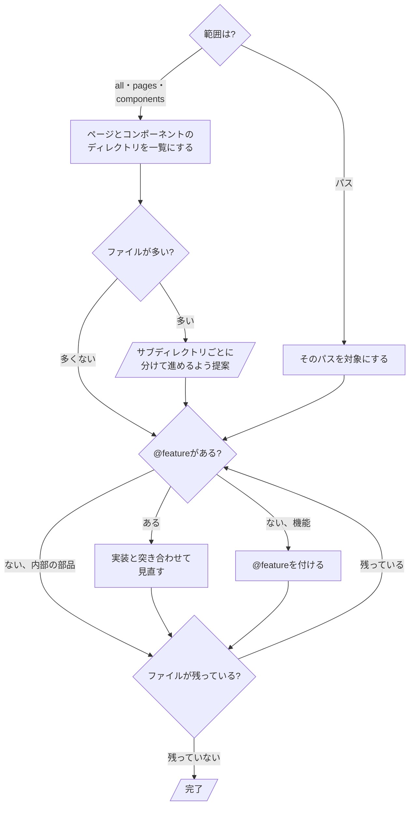

# feature-jsdoc

```mermaid
flowchart TD
  scope{範囲は?}
  scope -- "all・pages・<br/>components" --> list[ページとコンポーネントの<br/>ディレクトリを一覧にする]
  scope -- "パス" --> one[そのパスを対象にする]
  list --> many{ファイルが多い?}
  many -- "多い" --> split[/サブディレクトリごとに<br/>分けて進めるよう提案/]
  many -- "多くない" --> file
  split --> file
  one --> file{"@featureがある?"}
  file -- "ある" --> revise[実装と突き合わせて<br/>見直す]
  file -- "ない、機能" --> add["@featureを付ける"]
  file -- "ない、内部の部品" --> next
  revise --> next{ファイルが残っている?}
  add --> next
  next -- "残っている" --> file
  next -- "残っていない" --> done[/完了/]
```
