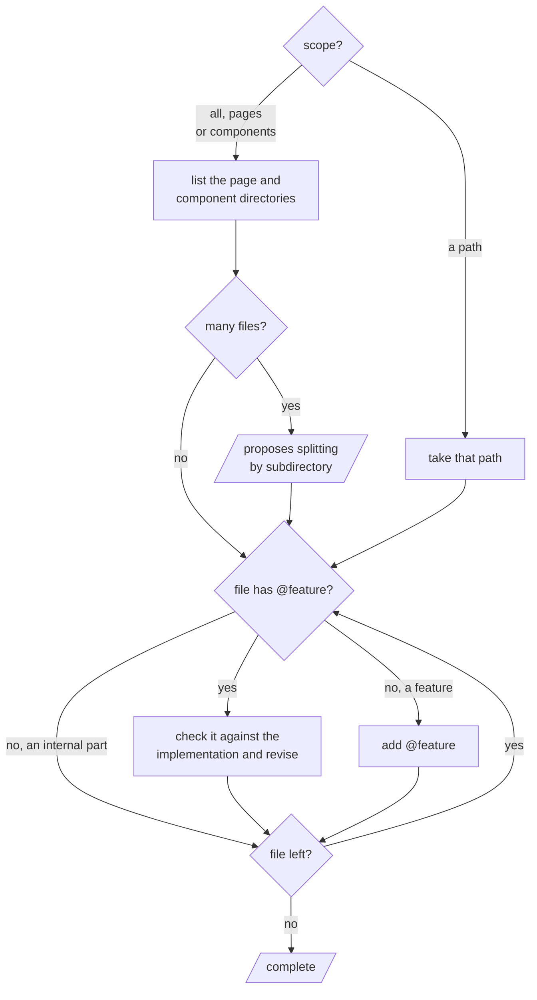

# feature-jsdoc

Adds or revises the @feature JSDoc on an app's pages and components, describing what each does from the user's point of view.

Parallelograms are what the user sees and answers.

```mermaid
flowchart TD
  scope{scope?}
  scope -- "all, pages<br/>or components" --> list[list the page and<br/>component directories]
  scope -- "a path" --> one[take that path]
  list --> many{many files?}
  many -- "yes" --> split[/proposes splitting<br/>by subdirectory/]
  many -- "no" --> file
  split --> file
  one --> file{"file has @feature?"}
  file -- "yes" --> revise[check it against the<br/>implementation and revise]
  file -- "no, a feature" --> add["add @feature"]
  file -- "no, an internal part" --> next
  revise --> next{file left?}
  add --> next
  next -- "yes" --> file
  next -- "no" --> done[/complete/]
```
