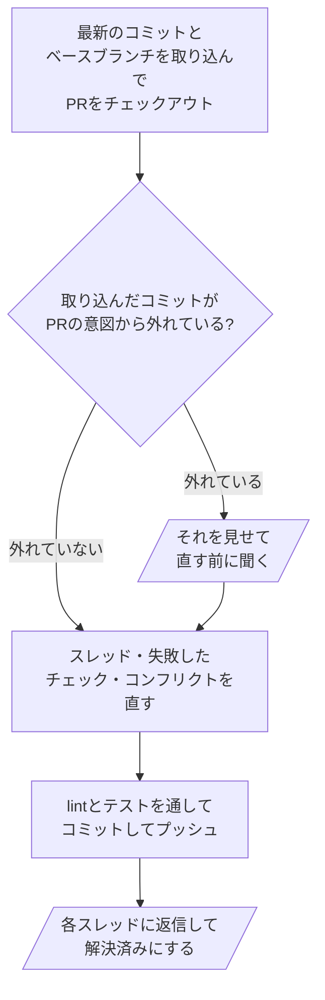

# fix-pr

PRの未解決のレビュースレッド、失敗しているCI、マージコンフリクトを直してプッシュし、各スレッドに返信する。

平行四辺形はユーザーに見えて、答えるもの。

```mermaid
flowchart TD
  fetch[最新のコミットと<br/>ベースブランチを取り込んで<br/>PRをチェックアウト]
  fetch --> pulled{取り込んだコミットが<br/>PRの意図から外れている?}
  pulled -- "外れている" --> ask[/それを見せて<br/>直す前に聞く/]
  pulled -- "外れていない" --> fix
  ask --> fix[スレッド・失敗した<br/>チェック・コンフリクトを直す]
  fix --> push[lintとテストを通して<br/>コミットしてプッシュ]
  push --> reply[/各スレッドに返信して<br/>解決済みにする/]
```
