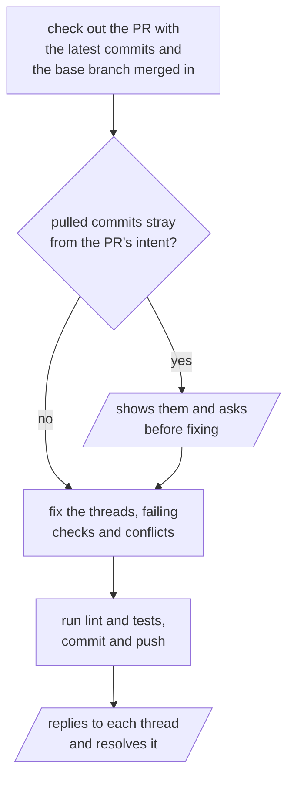

# fix-pr

Fixes a PR's unresolved review threads, failing CI and merge conflicts, then pushes and answers each thread.

Parallelograms are what the user sees and answers.

```mermaid
flowchart TD
  fetch[check out the PR with<br/>the latest commits and<br/>the base branch merged in]
  fetch --> pulled{pulled commits stray<br/>from the PR's intent?}
  pulled -- "yes" --> ask[/shows them and asks<br/>before fixing/]
  pulled -- "no" --> fix
  ask --> fix[fix the threads, failing<br/>checks and conflicts]
  fix --> push[run lint and tests,<br/>commit and push]
  push --> reply[/replies to each thread<br/>and resolves it/]
```
