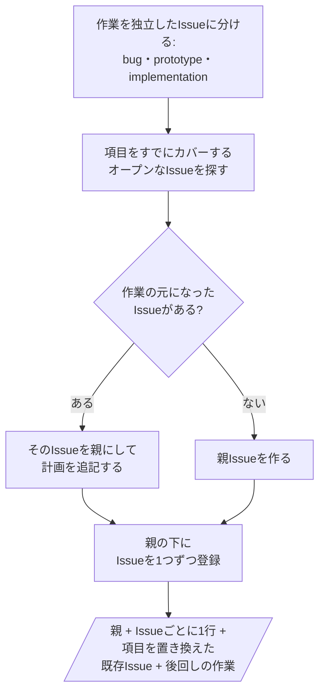

# remote-issue

1セッションに収まらない作業を、1つの親Issueの下の独立したIssueに分け、Issueワーカーに並行して実装させる。

平行四辺形はユーザーに見えて、答えるもの。

```mermaid
flowchart TD
  split["作業を独立したIssueに分ける:<br/>bug・prototype・<br/>implementation"]
  split --> similar[項目をすでにカバーする<br/>オープンなIssueを探す]
  similar --> origin{作業の元になった<br/>Issueがある?}
  origin -- "ある" --> comment[そのIssueを親にして<br/>計画を追記する]
  origin -- "ない" --> parent[親Issueを作る]
  comment --> create[親の下に<br/>Issueを1つずつ登録]
  parent --> create
  create --> report[/"親 + Issueごとに1行 +<br/>項目を置き換えた<br/>既存Issue + 後回しの作業"/]
```
