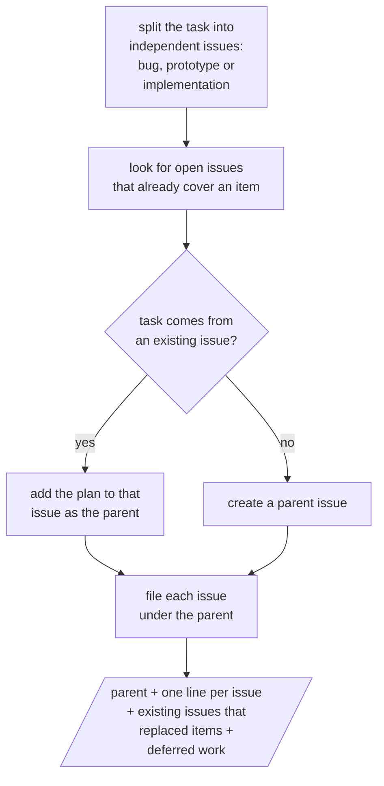

# remote-issue

```mermaid
flowchart TD
  split["split the task into<br/>independent issues:<br/>bug, prototype or<br/>implementation"]
  split --> similar[look for open issues<br/>that already cover an item]
  similar --> origin{task comes from<br/>an existing issue?}
  origin -- "yes" --> comment[add the plan to that<br/>issue as the parent]
  origin -- "no" --> parent[create a parent issue]
  comment --> create[file each issue<br/>under the parent]
  parent --> create
  create --> report[/"parent + one line per issue<br/>+ existing issues that<br/>replaced items +<br/>deferred work"/]
```
