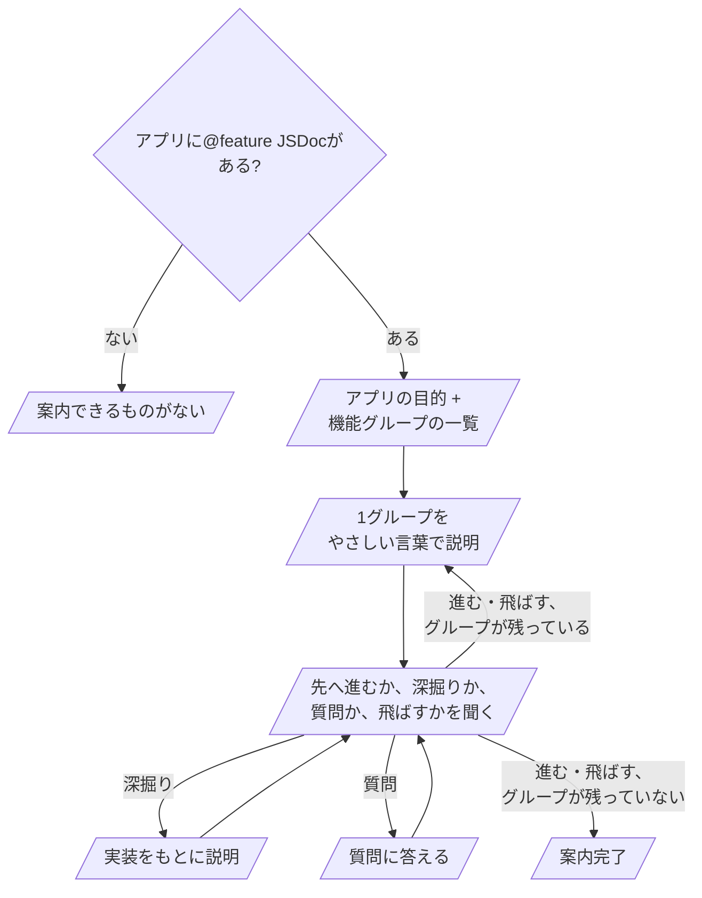

# tour

アプリの@feature JSDocをもとに、新しいメンバーにアプリでできることを機能グループごとに案内する。

平行四辺形はユーザーに見えて、答えるもの。

```mermaid
flowchart TD
  collect{"アプリに@feature JSDocがある?"}
  collect -- "ない" --> none[/案内できるものがない/]
  collect -- "ある" --> overview[/"アプリの目的 +<br/>機能グループの一覧"/]
  overview --> group[/1グループを<br/>やさしい言葉で説明/]
  group --> ask[/"先へ進むか、深掘りか、<br/>質問か、飛ばすかを聞く"/]
  ask -- "深掘り" --> deep[/実装をもとに説明/]
  deep --> ask
  ask -- "質問" --> answer[/質問に答える/]
  answer --> ask
  ask -- "進む・飛ばす、<br/>グループが残っている" --> group
  ask -- "進む・飛ばす、<br/>グループが残っていない" --> done[/案内完了/]
```
