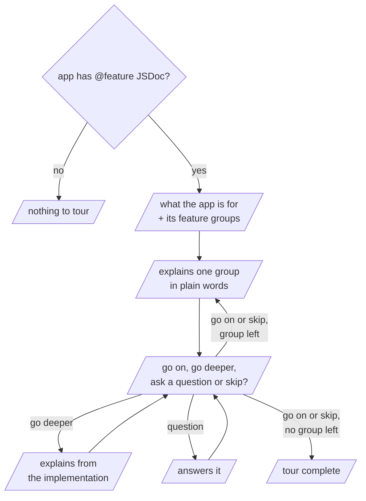

# tour

Walks a new member through what an app does, feature group by feature group, from its @feature JSDoc.

Parallelograms are what the user sees and answers.

```mermaid
flowchart TD
  collect{"app has @feature JSDoc?"}
  collect -- "no" --> none[/nothing to tour/]
  collect -- "yes" --> overview[/"what the app is for<br/>+ its feature groups"/]
  overview --> group[/explains one group<br/>in plain words/]
  group --> ask[/"go on, go deeper,<br/>ask a question or skip?"/]
  ask -- "go deeper" --> deep[/explains from<br/>the implementation/]
  deep --> ask
  ask -- "question" --> answer[/answers it/]
  answer --> ask
  ask -- "go on or skip,<br/>group left" --> group
  ask -- "go on or skip,<br/>no group left" --> done[/tour complete/]
```
