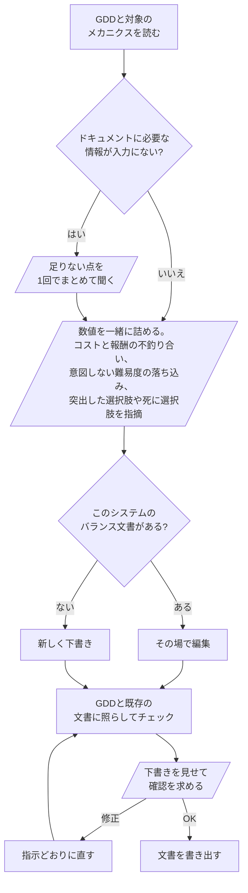

# balance

ゲームシステムのバランス（調整する数値、カーブ、その根拠）を設計・文書化する。

平行四辺形はユーザーに見えて、答えるもの。

```mermaid
flowchart TD
  read[GDDと対象の<br/>メカニクスを読む]
  read --> missing{ドキュメントに必要な<br/>情報が入力にない?}
  missing -- "はい" --> ask[/足りない点を<br/>1回でまとめて聞く/]
  missing -- "いいえ" --> work
  ask --> work[/"数値を一緒に詰める。<br/>コストと報酬の不釣り合い、<br/>意図しない難易度の落ち込み、<br/>突出した選択肢や死に選択肢を指摘"/]
  work --> exists{このシステムの<br/>バランス文書がある?}
  exists -- "ある" --> edit[その場で編集]
  exists -- "ない" --> draft[新しく下書き]
  edit --> check[GDDと既存の<br/>文書に照らしてチェック]
  draft --> check
  check --> confirm[/下書きを見せて<br/>確認を求める/]
  confirm -- "修正" --> revise[指示どおりに直す]
  revise --> check
  confirm -- "OK" --> save[文書を書き出す]
```
