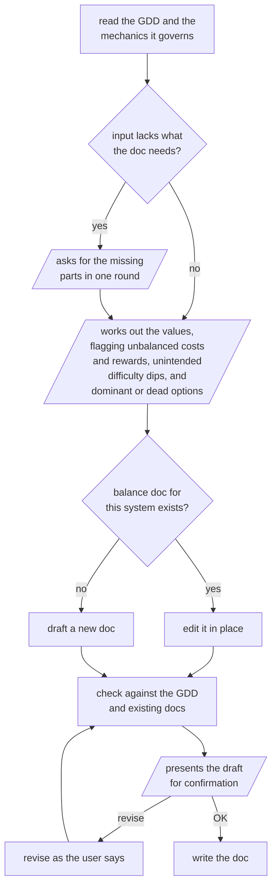

# balance

Designs or documents the balance of a game system: its tunable numbers, curves, and the reasoning behind them.

Parallelograms are what the user sees and answers.

```mermaid
flowchart TD
  read[read the GDD and the<br/>mechanics it governs]
  read --> missing{input lacks what<br/>the doc needs?}
  missing -- "yes" --> ask[/asks for the missing<br/>parts in one round/]
  missing -- "no" --> work
  ask --> work[/"works out the values,<br/>flagging unbalanced costs<br/>and rewards, unintended<br/>difficulty dips, and<br/>dominant or dead options"/]
  work --> exists{balance doc for<br/>this system exists?}
  exists -- "yes" --> edit[edit it in place]
  exists -- "no" --> draft[draft a new doc]
  edit --> check[check against the GDD<br/>and existing docs]
  draft --> check
  check --> confirm[/presents the draft<br/>for confirmation/]
  confirm -- "revise" --> revise[revise as the user says]
  revise --> check
  confirm -- "OK" --> save[write the doc]
```
