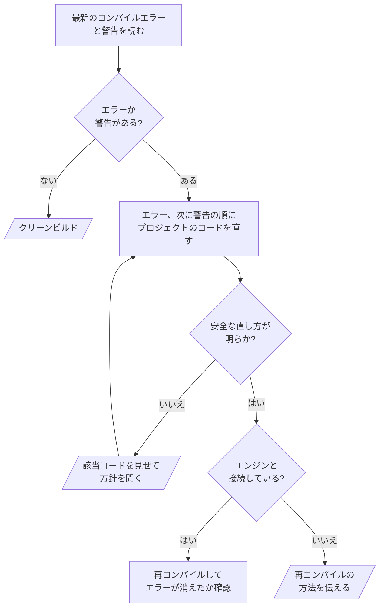

# fix

ゲームエンジンが出しているコンパイルエラーと警告を、プロジェクト自身のコードで直す。

平行四辺形はユーザーに見えて、答えるもの。

```mermaid
flowchart TD
  read[最新のコンパイルエラー<br/>と警告を読む]
  read --> any{エラーか<br/>警告がある?}
  any -- "ない" --> clean[/クリーンビルド/]
  any -- "ある" --> fix[エラー、次に警告の順に<br/>プロジェクトのコードを直す]
  fix --> safe{安全な直し方が<br/>明らか?}
  safe -- "いいえ" --> ask[/該当コードを見せて<br/>方針を聞く/]
  ask --> fix
  safe -- "はい" --> live{エンジンと<br/>接続している?}
  live -- "はい" --> recompile[再コンパイルして<br/>エラーが消えたか確認]
  live -- "いいえ" --> hint[/再コンパイルの<br/>方法を伝える/]
```
