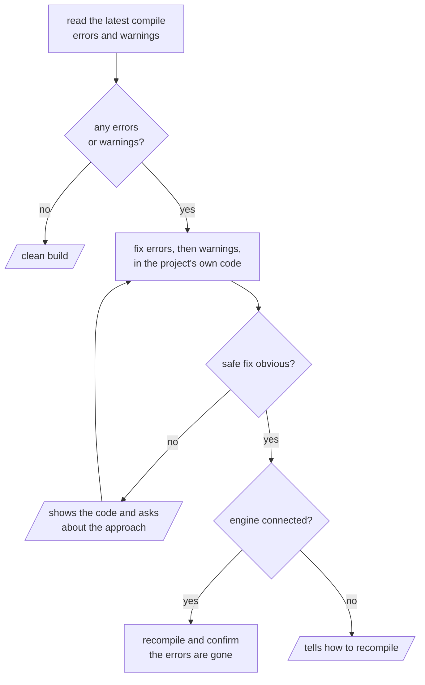

# fix

Fixes the compile errors and warnings the game engine is emitting, in the project's own code.

Parallelograms are what the user sees and answers.

```mermaid
flowchart TD
  read[read the latest compile<br/>errors and warnings]
  read --> any{any errors<br/>or warnings?}
  any -- "no" --> clean[/clean build/]
  any -- "yes" --> fix[fix errors, then warnings,<br/>in the project's own code]
  fix --> safe{safe fix obvious?}
  safe -- "no" --> ask[/shows the code and asks<br/>about the approach/]
  ask --> fix
  safe -- "yes" --> live{engine connected?}
  live -- "yes" --> recompile[recompile and confirm<br/>the errors are gone]
  live -- "no" --> hint[/tells how to recompile/]
```
