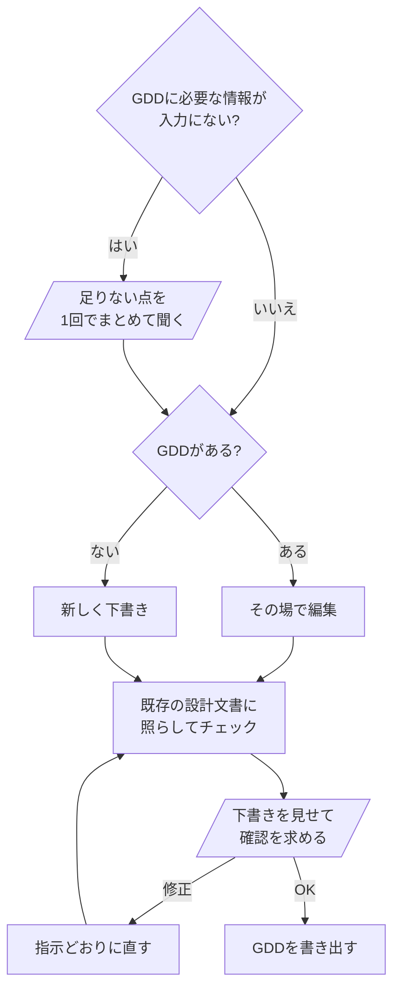

# gdd

ゲームデザインドキュメント（ゲームが何で、どう動くかの概要）を作成・編集する。

平行四辺形はユーザーに見えて、答えるもの。

```mermaid
flowchart TD
  missing{GDDに必要な情報が<br/>入力にない?}
  missing -- "はい" --> ask[/足りない点を<br/>1回でまとめて聞く/]
  missing -- "いいえ" --> exists
  ask --> exists{GDDがある?}
  exists -- "ある" --> edit[その場で編集]
  exists -- "ない" --> draft[新しく下書き]
  edit --> check[既存の設計文書に<br/>照らしてチェック]
  draft --> check
  check --> confirm[/下書きを見せて<br/>確認を求める/]
  confirm -- "修正" --> revise[指示どおりに直す]
  revise --> check
  confirm -- "OK" --> save[GDDを書き出す]
```
