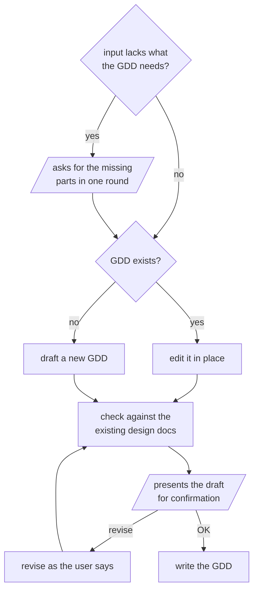

# gdd

Creates or edits the game design document: the overview of what the game is and how it works.

Parallelograms are what the user sees and answers.

```mermaid
flowchart TD
  missing{input lacks what<br/>the GDD needs?}
  missing -- "yes" --> ask[/asks for the missing<br/>parts in one round/]
  missing -- "no" --> exists
  ask --> exists{GDD exists?}
  exists -- "yes" --> edit[edit it in place]
  exists -- "no" --> draft[draft a new GDD]
  edit --> check[check against the<br/>existing design docs]
  draft --> check
  check --> confirm[/presents the draft<br/>for confirmation/]
  confirm -- "revise" --> revise[revise as the user says]
  revise --> check
  confirm -- "OK" --> save[write the GDD]
```
