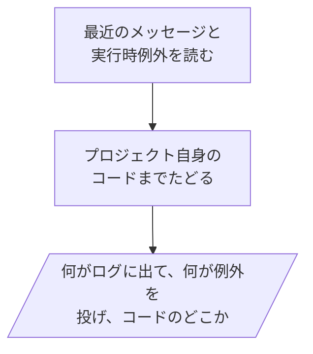

# logs

ゲームエンジンの実行時ログ（ログ出力、実行時例外とスタックトレース）を読む。

平行四辺形はユーザーに見えて、答えるもの。

```mermaid
flowchart TD
  read[最近のメッセージと<br/>実行時例外を読む]
  read --> trace[プロジェクト自身の<br/>コードまでたどる]
  trace --> report[/"何がログに出て、何が例外を<br/>投げ、コードのどこか"/]
```
