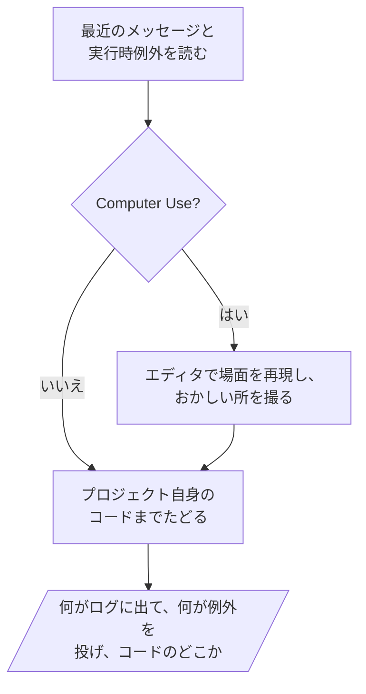

# logs

```mermaid
flowchart TD
  read[最近のメッセージと<br/>実行時例外を読む]
  read --> cu{Computer Use?}
  cu -- "はい" --> repro[エディタで場面を再現し、<br/>おかしい所を撮る]
  cu -- "いいえ" --> trace
  repro --> trace[プロジェクト自身の<br/>コードまでたどる]
  trace --> report[/"何がログに出て、何が例外を<br/>投げ、コードのどこか"/]
```
