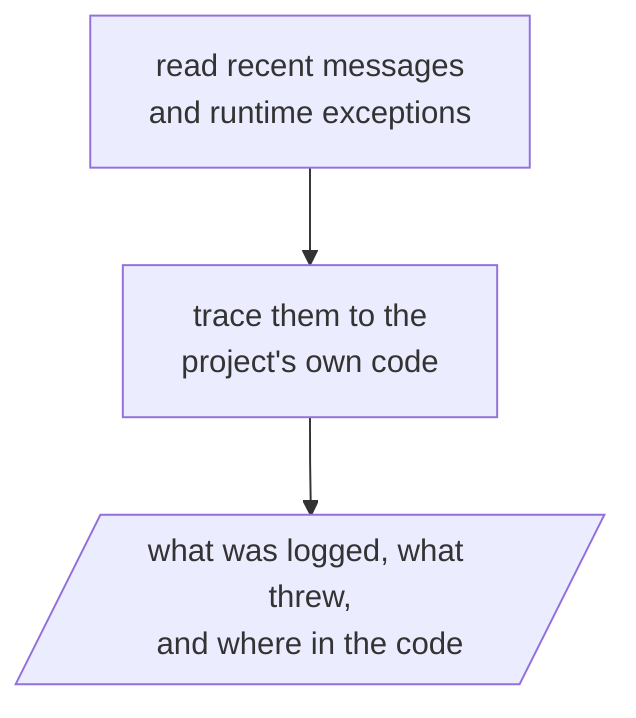

# logs

Reads the game engine's runtime log: logged output, runtime exceptions and their stack traces.

Parallelograms are what the user sees and answers.

```mermaid
flowchart TD
  read[read recent messages<br/>and runtime exceptions]
  read --> trace[trace them to the<br/>project's own code]
  trace --> report[/"what was logged, what threw,<br/>and where in the code"/]
```
