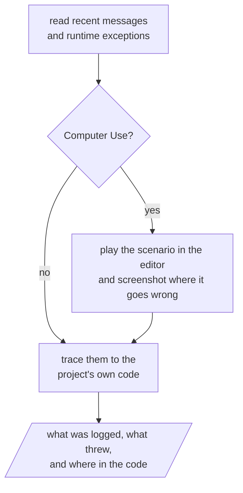

# logs

```mermaid
flowchart TD
  read[read recent messages<br/>and runtime exceptions]
  read --> cu{Computer Use?}
  cu -- "yes" --> repro[play the scenario in the editor<br/>and screenshot where it goes wrong]
  cu -- "no" --> trace
  repro --> trace[trace them to the<br/>project's own code]
  trace --> report[/"what was logged, what threw,<br/>and where in the code"/]
```
