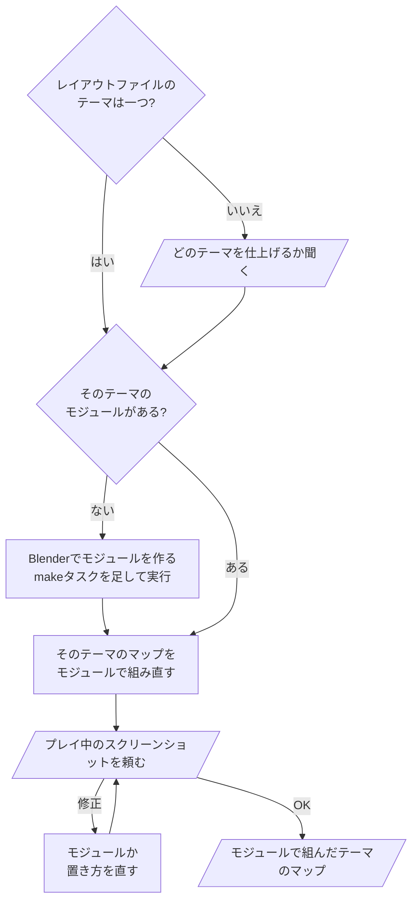

# map-art

```mermaid
flowchart TD
  theme{レイアウトファイルの<br/>テーマは一つ?}
  theme -- "いいえ" --> pick[/どのテーマを仕上げるか聞く/]
  theme -- "はい" --> has{そのテーマの<br/>モジュールがある?}
  pick --> has
  has -- "ない" --> model[Blenderでモジュールを作る<br/>makeタスクを足して実行]
  model --> swap[そのテーマのマップを<br/>モジュールで組み直す]
  has -- "ある" --> swap
  swap --> look[/プレイ中のスクリーンショットを頼む/]
  look -- "修正" --> fix[モジュールか<br/>置き方を直す]
  fix --> look
  look -- "OK" --> done[/モジュールで組んだテーマのマップ/]
```
