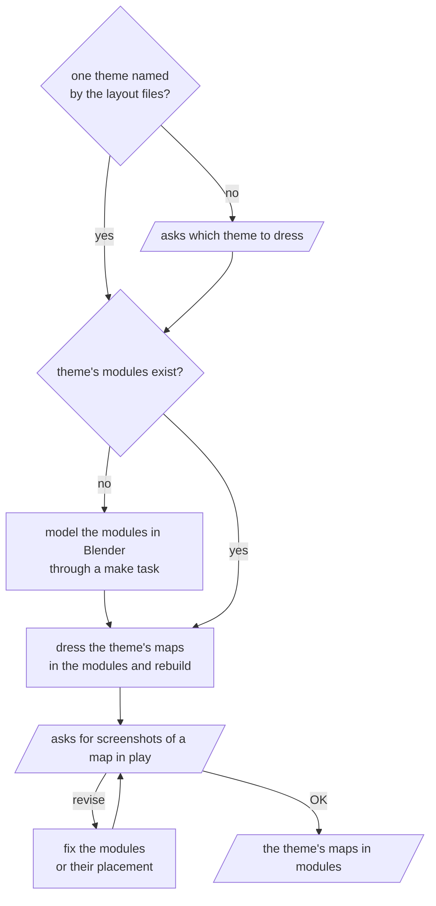

# map-art

```mermaid
flowchart TD
  theme{one theme named<br/>by the layout files?}
  theme -- "no" --> pick[/asks which theme to dress/]
  theme -- "yes" --> has{theme's modules exist?}
  pick --> has
  has -- "no" --> model[model the modules in Blender<br/>through a make task]
  model --> swap[dress the theme's maps<br/>in the modules and rebuild]
  has -- "yes" --> swap
  swap --> look[/asks for screenshots of a map in play/]
  look -- "revise" --> fix[fix the modules<br/>or their placement]
  fix --> look
  look -- "OK" --> done[/the theme's maps in modules/]
```
