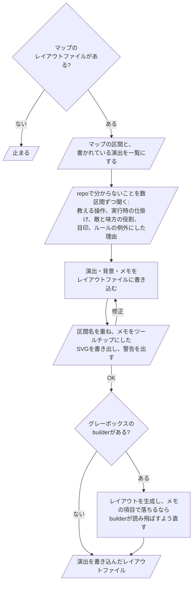

# map-beats

```mermaid
flowchart TD
  start{マップの<br/>レイアウトファイルがある?}
  start -- "ない" --> stop[/止まる/]
  start -- "ある" --> sections[/マップの区間と、<br/>書かれている演出を一覧にする/]
  sections --> ask[/repoで分からないことを数区間ずつ聞く:<br/>教える操作、実行時の仕掛け、敵と味方の役割、<br/>目印、ルールの例外にした理由/]
  ask --> write[演出・背景・メモを<br/>レイアウトファイルに書き込む]
  write --> view[/区間名を重ね、メモをツールチップにした<br/>SVGを書き出し、警告を出す/]
  view -- "修正" --> write
  view -- "OK" --> builder{グレーボックスの<br/>builderがある?}
  builder -- "ない" --> done
  builder -- "ある" --> build[レイアウトを生成し、メモの項目で落ちるなら<br/>builderが読み飛ばすよう直す]
  build --> done[/演出を書き込んだレイアウトファイル/]
```
