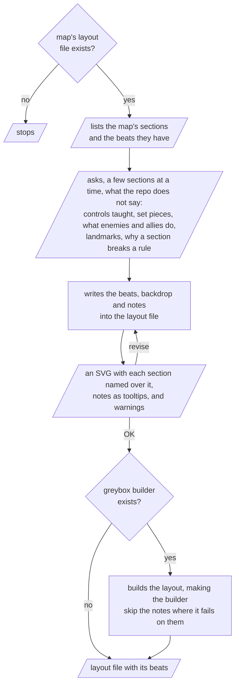

# map-beats

```mermaid
flowchart TD
  start{map's layout<br/>file exists?}
  start -- "no" --> stop[/stops/]
  start -- "yes" --> sections[/lists the map's sections<br/>and the beats they have/]
  sections --> ask[/asks, a few sections at a time, what the repo does not say:<br/>controls taught, set pieces, what enemies and allies do,<br/>landmarks, why a section breaks a rule/]
  ask --> write[writes the beats, backdrop and notes<br/>into the layout file]
  write --> view[/an SVG with each section named over it,<br/>notes as tooltips, and warnings/]
  view -- "revise" --> write
  view -- "OK" --> builder{greybox builder<br/>exists?}
  builder -- "no" --> done
  builder -- "yes" --> build[builds the layout, making the builder<br/>skip the notes where it fails on them]
  build --> done[/layout file with its beats/]
```
