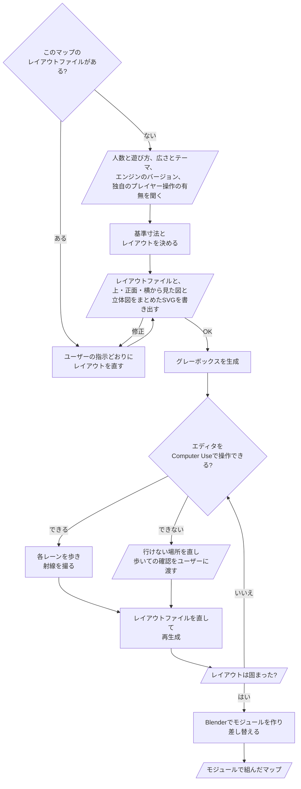

# map

```mermaid
flowchart TD
  exists{このマップの<br/>レイアウトファイルがある?}
  exists -- "ない" --> ask[/人数と遊び方、広さとテーマ、<br/>エンジンのバージョン、<br/>独自のプレイヤー操作の有無を聞く/]
  ask --> layout[基準寸法と<br/>レイアウトを決める]
  exists -- "ある" --> edit[ユーザーの指示どおりに<br/>レイアウトを直す]
  layout --> top[/レイアウトファイルと、上・正面・横から見た図と<br/>立体図をまとめたSVGを書き出す/]
  edit --> top
  top -- "修正" --> edit
  top -- "OK" --> build[グレーボックスを生成]
  build --> how{エディタを<br/>Computer Useで操作できる?}
  how -- "できる" --> walk[各レーンを歩き<br/>射線を撮る]
  how -- "できない" --> hand[/行けない場所を直し<br/>歩いての確認をユーザーに渡す/]
  walk --> fix[レイアウトファイルを直して<br/>再生成]
  hand --> fix
  fix --> settled[/レイアウトは固まった?/]
  settled -- "いいえ" --> how
  settled -- "はい" --> art[Blenderでモジュールを作り<br/>差し替える]
  art --> done[/モジュールで組んだマップ/]
```
