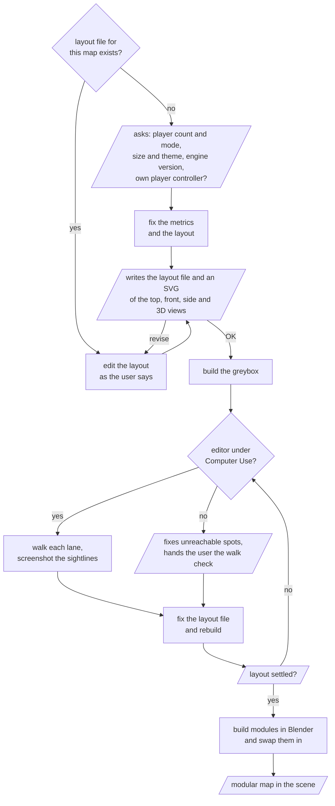

# map

```mermaid
flowchart TD
  exists{layout file for<br/>this map exists?}
  exists -- "no" --> ask[/asks: player count and mode,<br/>size and theme, engine version,<br/>own player controller?/]
  ask --> layout[fix the metrics<br/>and the layout]
  exists -- "yes" --> edit[edit the layout<br/>as the user says]
  layout --> top[/writes the layout file and an SVG<br/>of the top, front, side and 3D views/]
  edit --> top
  top -- "revise" --> edit
  top -- "OK" --> build[build the greybox]
  build --> how{editor under<br/>Computer Use?}
  how -- "yes" --> walk[walk each lane,<br/>screenshot the sightlines]
  how -- "no" --> hand[/fixes unreachable spots,<br/>hands the user the walk check/]
  walk --> fix[fix the layout file<br/>and rebuild]
  hand --> fix
  fix --> settled[/layout settled?/]
  settled -- "no" --> how
  settled -- "yes" --> art[build modules in Blender<br/>and swap them in]
  art --> done[/modular map in the scene/]
```
