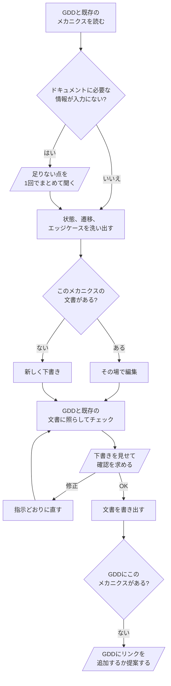

# mechanic

ゲームのメカニクス1つを、実装と調整ができる精度（入力、挙動、状態、パラメータ、エッジケース）で設計・文書化する。

平行四辺形はユーザーに見えて、答えるもの。

```mermaid
flowchart TD
  read[GDDと既存の<br/>メカニクスを読む]
  read --> missing{ドキュメントに必要な<br/>情報が入力にない?}
  missing -- "はい" --> ask[/足りない点を<br/>1回でまとめて聞く/]
  missing -- "いいえ" --> states
  ask --> states[状態、遷移、<br/>エッジケースを洗い出す]
  states --> exists{このメカニクスの<br/>文書がある?}
  exists -- "ある" --> edit[その場で編集]
  exists -- "ない" --> draft[新しく下書き]
  edit --> check[GDDと既存の<br/>文書に照らしてチェック]
  draft --> check
  check --> confirm[/下書きを見せて<br/>確認を求める/]
  confirm -- "修正" --> revise[指示どおりに直す]
  revise --> check
  confirm -- "OK" --> save[文書を書き出す]
  save --> linked{GDDにこの<br/>メカニクスがある?}
  linked -- "ない" --> offer[/GDDにリンクを<br/>追加するか提案する/]
```
