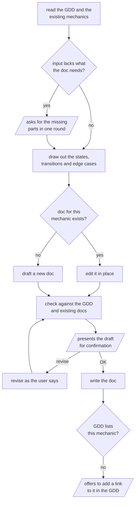

# mechanic

Designs or documents one game mechanic precisely enough to implement and balance: input, behaviour, states, parameters, edge cases.

Parallelograms are what the user sees and answers.

```mermaid
flowchart TD
  read[read the GDD and the<br/>existing mechanics]
  read --> missing{input lacks what<br/>the doc needs?}
  missing -- "yes" --> ask[/asks for the missing<br/>parts in one round/]
  missing -- "no" --> states
  ask --> states[draw out the states,<br/>transitions and edge cases]
  states --> exists{doc for this<br/>mechanic exists?}
  exists -- "yes" --> edit[edit it in place]
  exists -- "no" --> draft[draft a new doc]
  edit --> check[check against the GDD<br/>and existing docs]
  draft --> check
  check --> confirm[/presents the draft<br/>for confirmation/]
  confirm -- "revise" --> revise[revise as the user says]
  revise --> check
  confirm -- "OK" --> save[write the doc]
  save --> linked{GDD lists<br/>this mechanic?}
  linked -- "no" --> offer[/offers to add a link<br/>to it in the GDD/]
```
