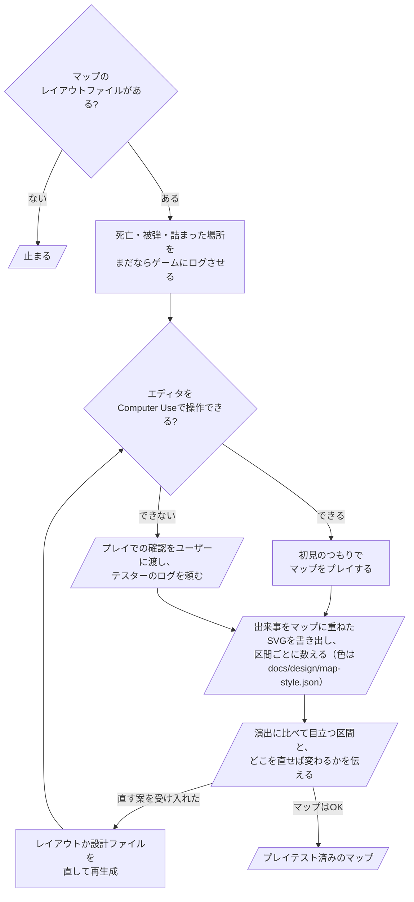

# playtest

```mermaid
flowchart TD
  start{マップの<br/>レイアウトファイルがある?}
  start -- "ない" --> stop[/止まる/]
  start -- "ある" --> log[死亡・被弾・詰まった場所を<br/>まだならゲームにログさせる]
  log --> how{エディタを<br/>Computer Useで操作できる?}
  how -- "できる" --> play[初見のつもりで<br/>マップをプレイする]
  how -- "できない" --> hand[/プレイでの確認をユーザーに渡し、<br/>テスターのログを頼む/]
  play --> heat
  hand --> heat[/出来事をマップに重ねたSVGを書き出し、<br/>区間ごとに数える（色は<br/>docs/design/map-style.json）/]
  heat --> weigh[/演出に比べて目立つ区間と、<br/>どこを直せば変わるかを伝える/]
  weigh -- "直す案を受け入れた" --> fix[レイアウトか設計ファイルを<br/>直して再生成]
  fix --> how
  weigh -- "マップはOK" --> done[/プレイテスト済みのマップ/]
```
