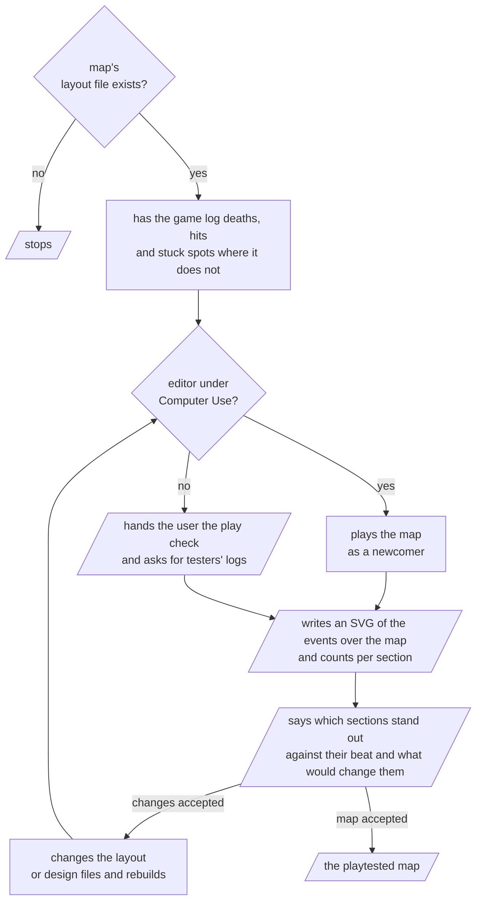

# playtest

```mermaid
flowchart TD
  start{map's<br/>layout file exists?}
  start -- "no" --> stop[/stops/]
  start -- "yes" --> log[has the game log deaths, hits<br/>and stuck spots where it does not]
  log --> how{editor under<br/>Computer Use?}
  how -- "yes" --> play[plays the map<br/>as a newcomer]
  how -- "no" --> hand[/hands the user the play check<br/>and asks for testers' logs/]
  play --> heat
  hand --> heat[/writes an SVG of the events over the map<br/>and counts per section/]
  heat --> weigh[/says which sections stand out<br/>against their beat and what would change them/]
  weigh -- "changes accepted" --> fix[changes the layout<br/>or design files and rebuilds]
  fix --> how
  weigh -- "map accepted" --> done[/the playtested map/]
```
