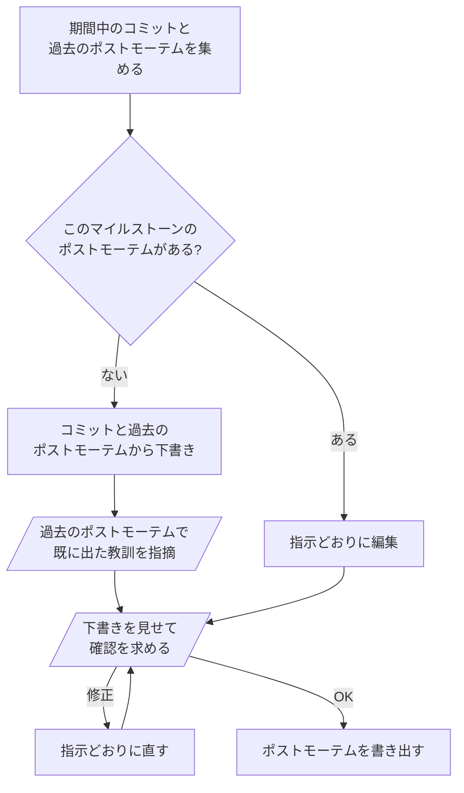

# post-mortem

```mermaid
flowchart TD
  gather[期間中のコミットと<br/>過去のポストモーテムを集める]
  gather --> exists{このマイルストーンの<br/>ポストモーテムがある?}
  exists -- "ある" --> edit[指示どおりに編集]
  exists -- "ない" --> draft[コミットと過去の<br/>ポストモーテムから下書き]
  draft --> repeat[/過去のポストモーテムで<br/>既に出た教訓を指摘/]
  repeat --> confirm
  edit --> confirm[/下書きを見せて<br/>確認を求める/]
  confirm -- "修正" --> revise[指示どおりに直す]
  revise --> confirm
  confirm -- "OK" --> save[ポストモーテムを書き出す]
```
