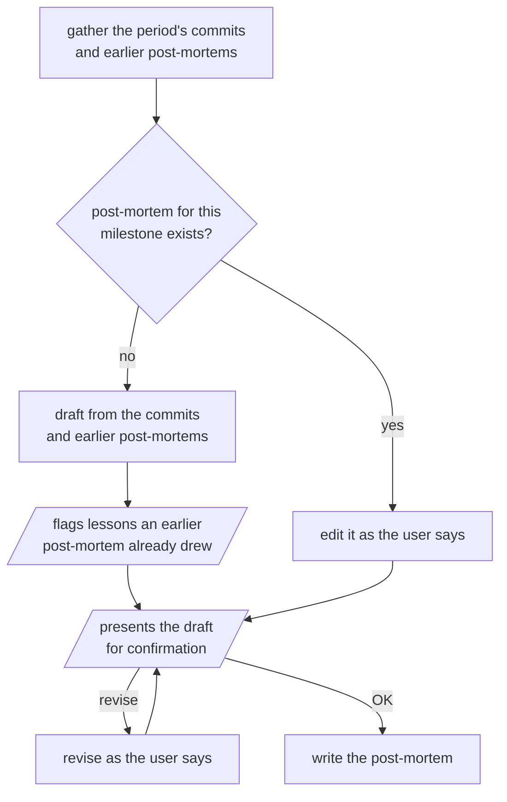

# post-mortem

```mermaid
flowchart TD
  gather[gather the period's commits<br/>and earlier post-mortems]
  gather --> exists{post-mortem for this<br/>milestone exists?}
  exists -- "yes" --> edit[edit it as the user says]
  exists -- "no" --> draft[draft from the commits<br/>and earlier post-mortems]
  draft --> repeat[/flags lessons an earlier<br/>post-mortem already drew/]
  repeat --> confirm
  edit --> confirm[/presents the draft<br/>for confirmation/]
  confirm -- "revise" --> revise[revise as the user says]
  revise --> confirm
  confirm -- "OK" --> save[write the post-mortem]
```
