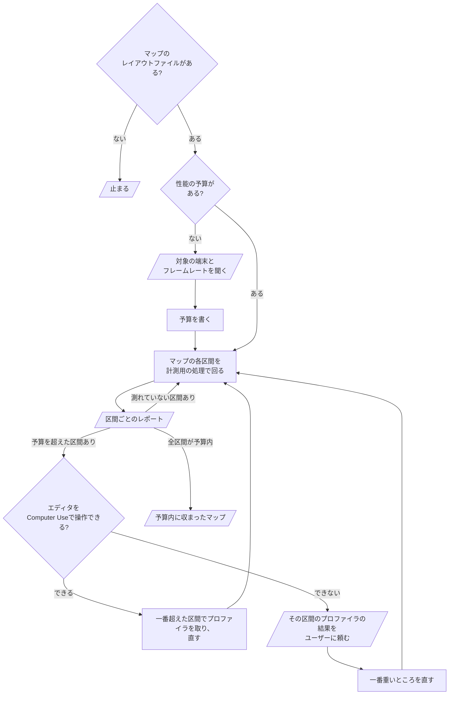

# profile

```mermaid
flowchart TD
  start{マップの<br/>レイアウトファイルがある?}
  start -- "ない" --> stop[/止まる/]
  start -- "ある" --> budget{性能の予算が<br/>ある?}
  budget -- "ない" --> ask[/対象の端末と<br/>フレームレートを聞く/]
  ask --> write[予算を書く]
  write --> sample
  budget -- "ある" --> sample[マップの各区間を<br/>計測用の処理で回る]
  sample --> report[/区間ごとのレポート/]
  report -- "測れていない区間あり" --> sample
  report -- "予算を超えた区間あり" --> how{エディタを<br/>Computer Useで操作できる?}
  how -- "できる" --> capture[一番超えた区間でプロファイラを取り、<br/>直す]
  how -- "できない" --> hand[/その区間のプロファイラの結果を<br/>ユーザーに頼む/]
  hand --> fix[一番重いところを直す]
  capture --> sample
  fix --> sample
  report -- "全区間が予算内" --> done[/予算内に収まったマップ/]
```
