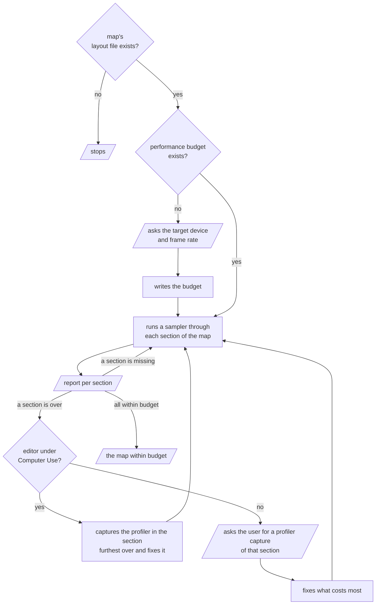

# profile

```mermaid
flowchart TD
  start{map's<br/>layout file exists?}
  start -- "no" --> stop[/stops/]
  start -- "yes" --> budget{performance budget<br/>exists?}
  budget -- "no" --> ask[/asks the target device<br/>and frame rate/]
  ask --> write[writes the budget]
  write --> sample
  budget -- "yes" --> sample[runs a sampler through<br/>each section of the map]
  sample --> report[/report per section/]
  report -- "a section is missing" --> sample
  report -- "a section is over" --> how{editor under<br/>Computer Use?}
  how -- "yes" --> capture[captures the profiler in the section<br/>furthest over and fixes it]
  how -- "no" --> hand[/asks the user for a profiler capture<br/>of that section/]
  hand --> fix[fixes what costs most]
  capture --> sample
  fix --> sample
  report -- "all within budget" --> done[/the map within budget/]
```
