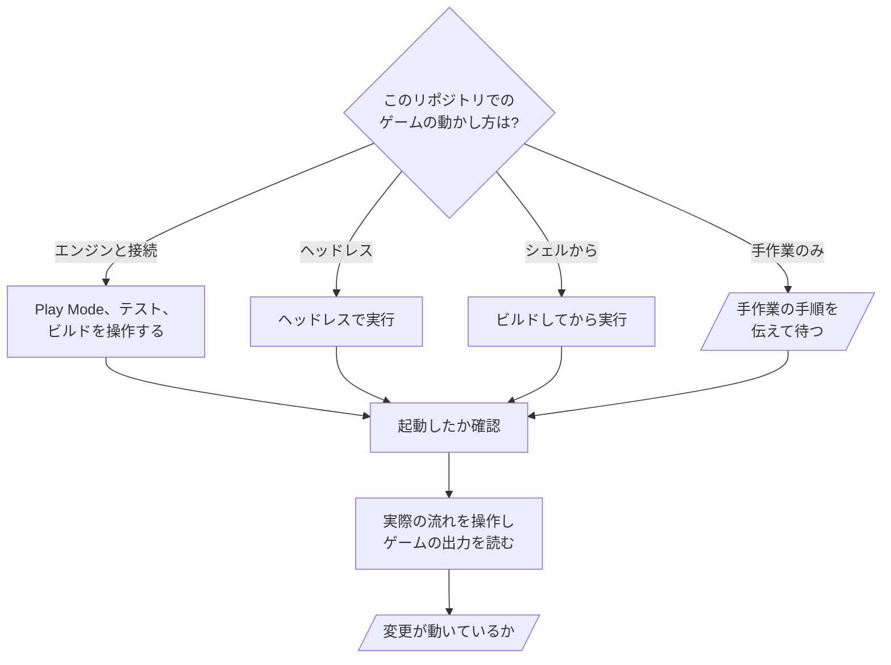

# run

変更が動くところを確かめるために、ゲームをビルドして実行する。

平行四辺形はユーザーに見えて、答えるもの。

```mermaid
flowchart TD
  how{このリポジトリでの<br/>ゲームの動かし方は?}
  how -- "エンジンと接続" --> drive[Play Mode、テスト、<br/>ビルドを操作する]
  how -- "ヘッドレス" --> headless[ヘッドレスで実行]
  how -- "シェルから" --> build[ビルドしてから実行]
  how -- "手作業のみ" --> manual[/手作業の手順を<br/>伝えて待つ/]
  drive --> up[起動したか確認]
  headless --> up
  build --> up
  manual --> up
  up --> play[実際の流れを操作し<br/>ゲームの出力を読む]
  play --> result[/変更が動いているか/]
```
