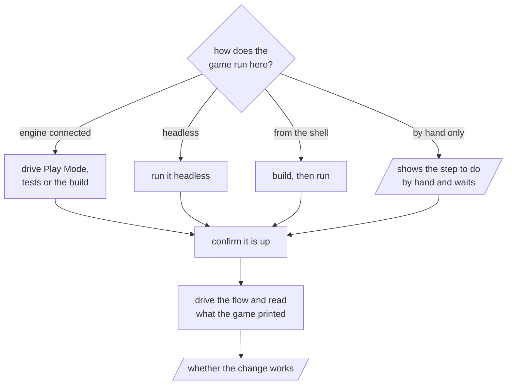

# run

Builds and runs the game so a change can be seen working.

Parallelograms are what the user sees and answers.

```mermaid
flowchart TD
  how{how does the<br/>game run here?}
  how -- "engine connected" --> drive[drive Play Mode,<br/>tests or the build]
  how -- "headless" --> headless[run it headless]
  how -- "from the shell" --> build[build, then run]
  how -- "by hand only" --> manual[/shows the step to do<br/>by hand and waits/]
  drive --> up[confirm it is up]
  headless --> up
  build --> up
  manual --> up
  up --> play[drive the flow and read<br/>what the game printed]
  play --> result[/whether the change works/]
```
