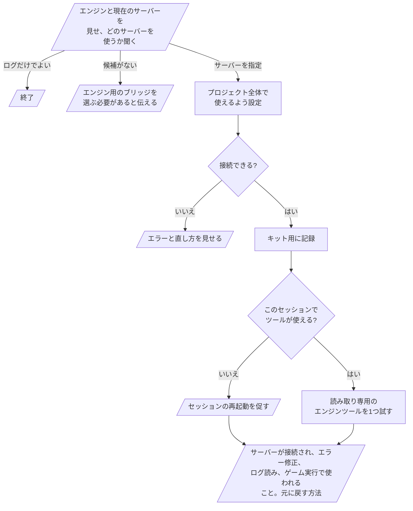

# setup-mcp

任意のエンジン操作サーバーを接続し、キットがログを読む代わりに動いているエンジンを直接操作できるようにする。

平行四辺形はユーザーに見えて、答えるもの。

```mermaid
flowchart TD
  ask[/"エンジンと現在のサーバーを<br/>見せ、どのサーバーを<br/>使うか聞く"/]
  ask -- "ログだけでよい" --> stop[/終了/]
  ask -- "候補がない" --> pick[/エンジン用のブリッジを<br/>選ぶ必要があると伝える/]
  ask -- "サーバーを指定" --> add[プロジェクト全体で<br/>使えるよう設定]
  add --> conn{接続できる?}
  conn -- "いいえ" --> err[/エラーと直し方を見せる/]
  conn -- "はい" --> record[キット用に記録]
  record --> tools{このセッションで<br/>ツールが使える?}
  tools -- "いいえ" --> restart[/セッションの再起動を促す/]
  tools -- "はい" --> try[読み取り専用の<br/>エンジンツールを1つ試す]
  restart --> done
  try --> done[/"サーバーが接続され、エラー修正、<br/>ログ読み、ゲーム実行で使われる<br/>こと。元に戻す方法"/]
```
