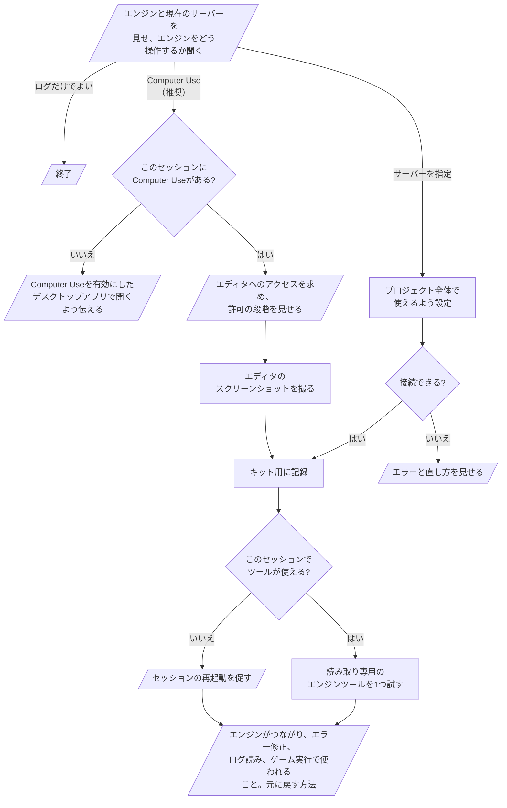

# setup-mcp

```mermaid
flowchart TD
  ask[/"エンジンと現在のサーバーを<br/>見せ、エンジンをどう<br/>操作するか聞く"/]
  ask -- "ログだけでよい" --> stop[/終了/]
  ask -- "Computer Use<br/>（推奨）" --> cu{このセッションに<br/>Computer Useがある?}
  cu -- "いいえ" --> desktop[/Computer Useを有効にした<br/>デスクトップアプリで開くよう伝える/]
  cu -- "はい" --> access[/エディタへのアクセスを求め、<br/>許可の段階を見せる/]
  access --> shot[エディタの<br/>スクリーンショットを撮る]
  shot --> record
  ask -- "サーバーを指定" --> add[プロジェクト全体で<br/>使えるよう設定]
  add --> conn{接続できる?}
  conn -- "いいえ" --> err[/エラーと直し方を見せる/]
  conn -- "はい" --> record[キット用に記録]
  record --> tools{このセッションで<br/>ツールが使える?}
  tools -- "いいえ" --> restart[/セッションの再起動を促す/]
  tools -- "はい" --> try[読み取り専用の<br/>エンジンツールを1つ試す]
  restart --> done
  try --> done[/"エンジンがつながり、エラー修正、<br/>ログ読み、ゲーム実行で使われる<br/>こと。元に戻す方法"/]
```
