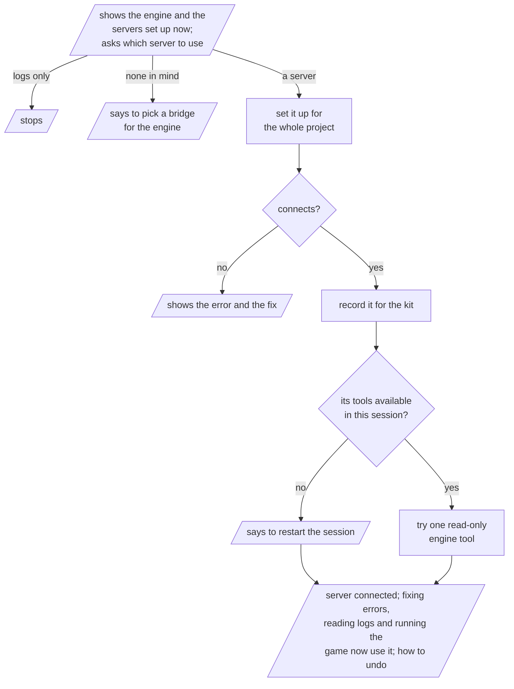

# setup-mcp

Connects an optional engine-control server so the kit drives the live engine instead of reading its logs.

Parallelograms are what the user sees and answers.

```mermaid
flowchart TD
  ask[/"shows the engine and the<br/>servers set up now;<br/>asks which server to use"/]
  ask -- "logs only" --> stop[/stops/]
  ask -- "none in mind" --> pick[/says to pick a bridge<br/>for the engine/]
  ask -- "a server" --> add[set it up for<br/>the whole project]
  add --> conn{connects?}
  conn -- "no" --> err[/shows the error and the fix/]
  conn -- "yes" --> record[record it for the kit]
  record --> tools{its tools available<br/>in this session?}
  tools -- "no" --> restart[/says to restart the session/]
  tools -- "yes" --> try[try one read-only<br/>engine tool]
  restart --> done
  try --> done[/"server connected; fixing errors,<br/>reading logs and running the<br/>game now use it; how to undo"/]
```
