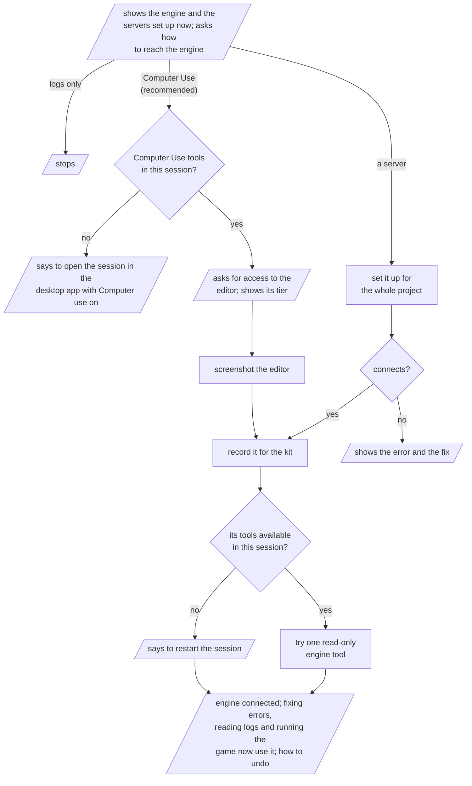

# setup-mcp

```mermaid
flowchart TD
  ask[/"shows the engine and the<br/>servers set up now; asks how<br/>to reach the engine"/]
  ask -- "logs only" --> stop[/stops/]
  ask -- "Computer Use<br/>(recommended)" --> cu{Computer Use tools<br/>in this session?}
  cu -- "no" --> desktop[/says to open the session in the<br/>desktop app with Computer use on/]
  cu -- "yes" --> access[/asks for access to the<br/>editor; shows its tier/]
  access --> shot[screenshot the editor]
  shot --> record
  ask -- "a server" --> add[set it up for<br/>the whole project]
  add --> conn{connects?}
  conn -- "no" --> err[/shows the error and the fix/]
  conn -- "yes" --> record[record it for the kit]
  record --> tools{its tools available<br/>in this session?}
  tools -- "no" --> restart[/says to restart the session/]
  tools -- "yes" --> try[try one read-only<br/>engine tool]
  restart --> done
  try --> done[/"engine connected; fixing errors,<br/>reading logs and running the<br/>game now use it; how to undo"/]
```
