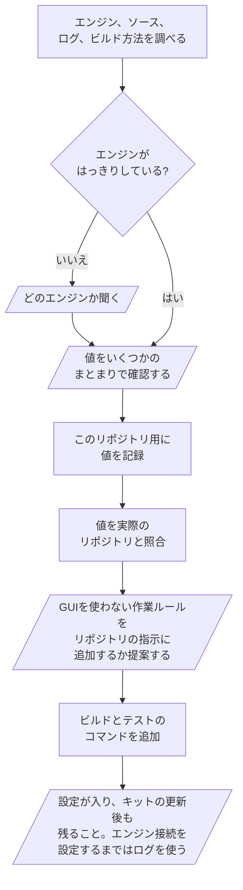

# setup

エンジンの実際の情報（ソースフォルダ、ログ、エラー形式、ビルドと実行のコマンド）を記録して、キットをこのリポジトリに合わせる。

平行四辺形はユーザーに見えて、答えるもの。

```mermaid
flowchart TD
  detect[エンジン、ソース、<br/>ログ、ビルド方法を調べる]
  detect --> clear{エンジンが<br/>はっきりしている?}
  clear -- "いいえ" --> which[/どのエンジンか聞く/]
  which --> values
  clear -- "はい" --> values[/値をいくつかの<br/>まとまりで確認する/]
  values --> write[このリポジトリ用に<br/>値を記録]
  write --> verify[値を実際の<br/>リポジトリと照合]
  verify --> rule[/"GUIを使わない作業ルールを<br/>リポジトリの指示に<br/>追加するか提案する"/]
  rule --> tasks[ビルドとテストの<br/>コマンドを追加]
  tasks --> report[/"設定が入り、キットの更新後も<br/>残ること。エンジン接続を<br/>設定するまではログを使う"/]
```
