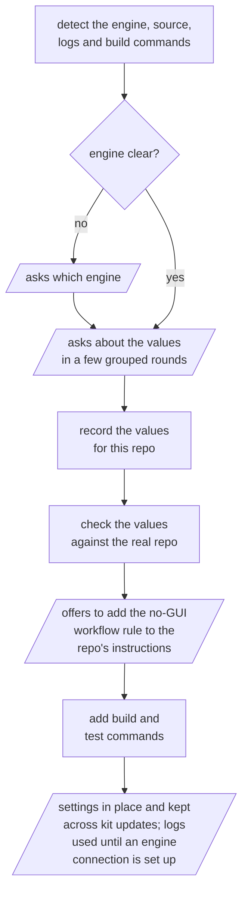

# setup

Adapts the kit to this repo by recording the engine's real facts: source folders, logs, error formats, and build and run commands.

Parallelograms are what the user sees and answers.

```mermaid
flowchart TD
  detect[detect the engine, source,<br/>logs and build commands]
  detect --> clear{engine clear?}
  clear -- "no" --> which[/asks which engine/]
  which --> values
  clear -- "yes" --> values[/asks about the values<br/>in a few grouped rounds/]
  values --> write[record the values<br/>for this repo]
  write --> verify[check the values<br/>against the real repo]
  verify --> rule[/"offers to add the no-GUI<br/>workflow rule to the<br/>repo's instructions"/]
  rule --> tasks[add build and<br/>test commands]
  tasks --> report[/"settings in place and kept<br/>across kit updates; logs<br/>used until an engine<br/>connection is set up"/]
```
