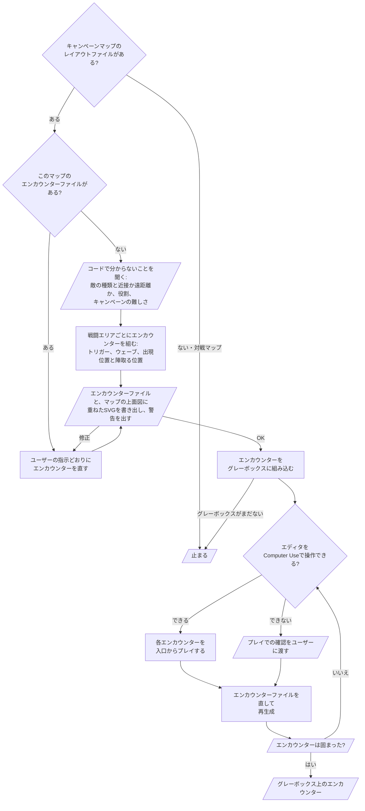

# shooter-encounter

```mermaid
flowchart TD
  start{キャンペーンマップの<br/>レイアウトファイルがある?}
  start -- "ない・対戦マップ" --> stop[/止まる/]
  start -- "ある" --> exists{このマップの<br/>エンカウンターファイルがある?}
  exists -- "ない" --> ask[/コードで分からないことを聞く:<br/>敵の種類と近接か遠距離か、役割、<br/>キャンペーンの難しさ/]
  ask --> write[戦闘エリアごとにエンカウンターを組む:<br/>トリガー、ウェーブ、出現位置と陣取る位置]
  exists -- "ある" --> edit[ユーザーの指示どおりに<br/>エンカウンターを直す]
  write --> view
  edit --> view[/エンカウンターファイルと、マップの上面図に<br/>重ねたSVGを書き出し、警告を出す/]
  view -- "修正" --> edit
  view -- "OK" --> build[エンカウンターを<br/>グレーボックスに組み込む]
  build -- "グレーボックスがまだない" --> stop
  build --> how{エディタを<br/>Computer Useで操作できる?}
  how -- "できる" --> play[各エンカウンターを<br/>入口からプレイする]
  how -- "できない" --> hand[/プレイでの確認をユーザーに渡す/]
  play --> fix[エンカウンターファイルを直して<br/>再生成]
  hand --> fix
  fix --> settled[/エンカウンターは固まった?/]
  settled -- "いいえ" --> how
  settled -- "はい" --> done[/グレーボックス上のエンカウンター/]
```
