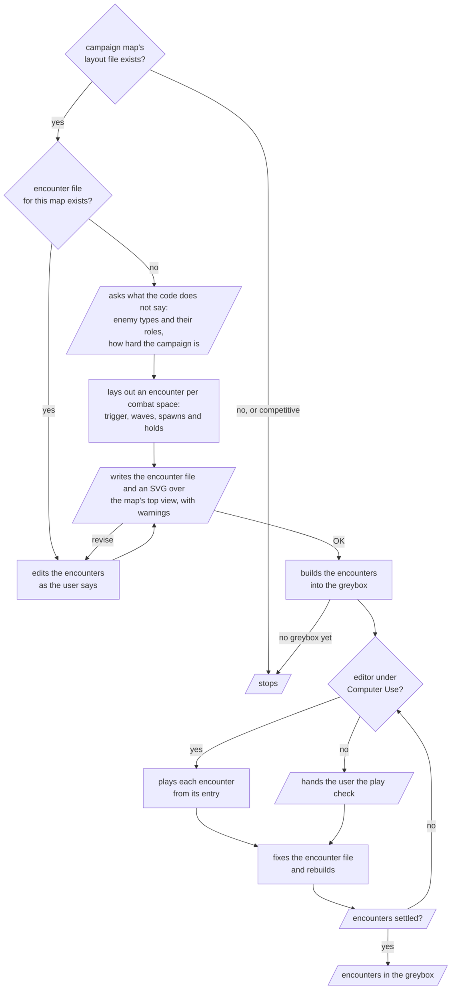

# shooter-encounter

```mermaid
flowchart TD
  start{campaign map's<br/>layout file exists?}
  start -- "no, or competitive" --> stop[/stops/]
  start -- "yes" --> exists{encounter file<br/>for this map exists?}
  exists -- "no" --> ask[/asks what the code does not say:<br/>enemy types and their roles,<br/>how hard the campaign is/]
  ask --> write[lays out an encounter per combat space:<br/>trigger, waves, spawns and holds]
  exists -- "yes" --> edit[edits the encounters<br/>as the user says]
  write --> view
  edit --> view[/writes the encounter file and an SVG over<br/>the map's top view, with warnings/]
  view -- "revise" --> edit
  view -- "OK" --> build[builds the encounters<br/>into the greybox]
  build -- "no greybox yet" --> stop
  build --> how{editor under<br/>Computer Use?}
  how -- "yes" --> play[plays each encounter<br/>from its entry]
  how -- "no" --> hand[/hands the user the play check/]
  play --> fix[fixes the encounter file<br/>and rebuilds]
  hand --> fix
  fix --> settled[/encounters settled?/]
  settled -- "no" --> how
  settled -- "yes" --> done[/encounters in the greybox/]
```
