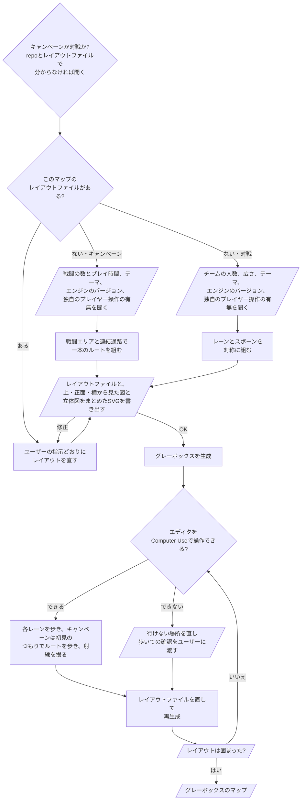

# shooter-map

```mermaid
flowchart TD
  mode{キャンペーンか対戦か?<br/>repoとレイアウトファイルで<br/>分からなければ聞く}
  mode --> exists{このマップの<br/>レイアウトファイルがある?}
  exists -- "ない・キャンペーン" --> askc[/戦闘の数とプレイ時間、テーマ、<br/>エンジンのバージョン、<br/>独自のプレイヤー操作の有無を聞く/]
  exists -- "ない・対戦" --> askp[/チームの人数、広さ、テーマ、<br/>エンジンのバージョン、<br/>独自のプレイヤー操作の有無を聞く/]
  askc --> layoutc[戦闘エリアと連結通路で<br/>一本のルートを組む]
  askp --> layoutp[レーンとスポーンを<br/>対称に組む]
  layoutc --> top
  layoutp --> top
  exists -- "ある" --> edit[ユーザーの指示どおりに<br/>レイアウトを直す]
  edit --> top[/レイアウトファイルと、上・正面・横から見た図と<br/>立体図をまとめたSVGを書き出す/]
  top -- "修正" --> edit
  top -- "OK" --> build[グレーボックスを生成]
  build --> how{エディタを<br/>Computer Useで操作できる?}
  how -- "できる" --> walk[各レーンを歩き、キャンペーンは初見の<br/>つもりでルートを歩き、射線を撮る]
  how -- "できない" --> hand[/行けない場所を直し<br/>歩いての確認をユーザーに渡す/]
  walk --> fix[レイアウトファイルを直して<br/>再生成]
  hand --> fix
  fix --> settled[/レイアウトは固まった?/]
  settled -- "いいえ" --> how
  settled -- "はい" --> done[/グレーボックスのマップ/]
```
