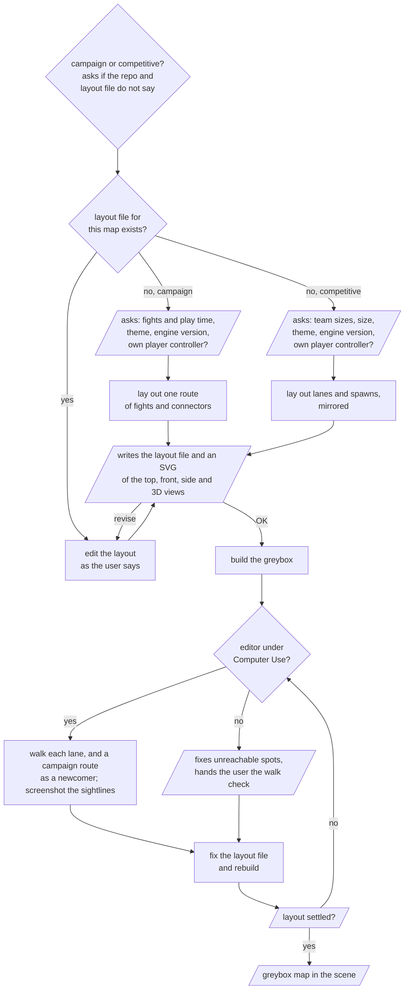

# shooter-map

```mermaid
flowchart TD
  mode{campaign or competitive?<br/>asks if the repo and<br/>layout file do not say}
  mode --> exists{layout file for<br/>this map exists?}
  exists -- "no, campaign" --> askc[/asks: fights and play time,<br/>theme, engine version,<br/>own player controller?/]
  exists -- "no, competitive" --> askp[/asks: team sizes, size,<br/>theme, engine version,<br/>own player controller?/]
  askc --> layoutc[lay out one route<br/>of fights and connectors]
  askp --> layoutp[lay out lanes and spawns,<br/>mirrored]
  layoutc --> top
  layoutp --> top
  exists -- "yes" --> edit[edit the layout<br/>as the user says]
  edit --> top[/writes the layout file and an SVG<br/>of the top, front, side and 3D views/]
  top -- "revise" --> edit
  top -- "OK" --> build[build the greybox]
  build --> how{editor under<br/>Computer Use?}
  how -- "yes" --> walk[walk each lane, and a campaign route<br/>as a newcomer; screenshot the sightlines]
  how -- "no" --> hand[/fixes unreachable spots,<br/>hands the user the walk check/]
  walk --> fix[fix the layout file<br/>and rebuild]
  hand --> fix
  fix --> settled[/layout settled?/]
  settled -- "no" --> how
  settled -- "yes" --> done[/greybox map in the scene/]
```
