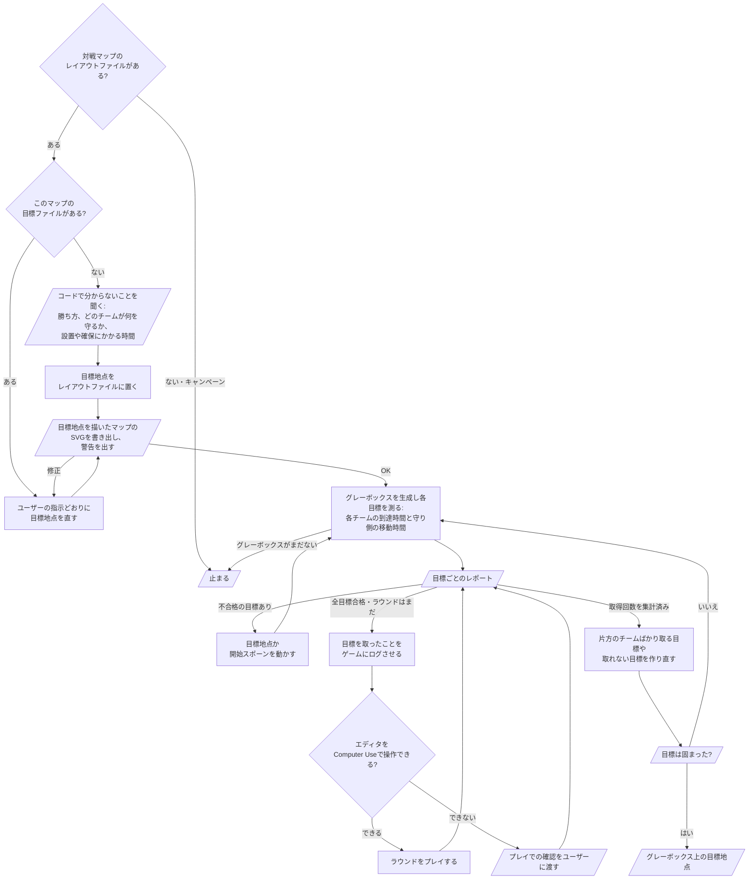

# shooter-objectives

```mermaid
flowchart TD
  start{対戦マップの<br/>レイアウトファイルがある?}
  start -- "ない・キャンペーン" --> stop[/止まる/]
  start -- "ある" --> exists{このマップの<br/>目標ファイルがある?}
  exists -- "ない" --> ask[/コードで分からないことを聞く:<br/>勝ち方、どのチームが何を守るか、<br/>設置や確保にかかる時間/]
  ask --> place[目標地点を<br/>レイアウトファイルに置く]
  exists -- "ある" --> edit[ユーザーの指示どおりに<br/>目標地点を直す]
  place --> view
  edit --> view[/目標地点を描いたマップのSVGを書き出し、<br/>警告を出す/]
  view -- "修正" --> edit
  view -- "OK" --> measure[グレーボックスを生成し各目標を測る:<br/>各チームの到達時間と守り側の移動時間]
  measure -- "グレーボックスがまだない" --> stop
  measure --> report[/目標ごとのレポート/]
  report -- "不合格の目標あり" --> move[目標地点か<br/>開始スポーンを動かす]
  move --> measure
  report -- "全目標合格・ラウンドはまだ" --> take[目標を取ったことを<br/>ゲームにログさせる]
  take --> how{エディタを<br/>Computer Useで操作できる?}
  how -- "できる" --> play[ラウンドをプレイする]
  how -- "できない" --> hand[/プレイでの確認をユーザーに渡す/]
  play --> report
  hand --> report
  report -- "取得回数を集計済み" --> weigh[片方のチームばかり取る目標や<br/>取れない目標を作り直す]
  weigh --> settled[/目標は固まった?/]
  settled -- "いいえ" --> measure
  settled -- "はい" --> done[/グレーボックス上の目標地点/]
```
