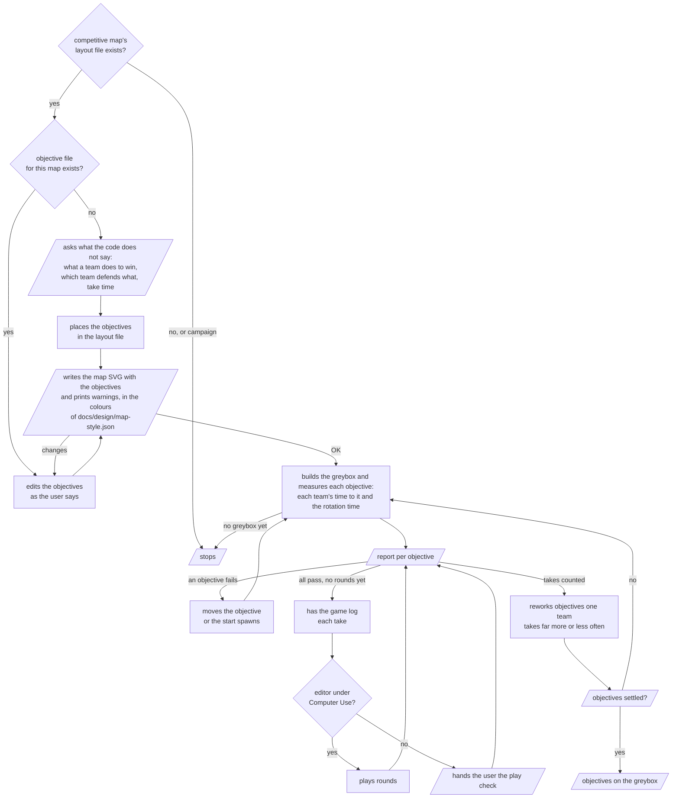

# shooter-objectives

```mermaid
flowchart TD
  start{competitive map's<br/>layout file exists?}
  start -- "no, or campaign" --> stop[/stops/]
  start -- "yes" --> exists{objective file<br/>for this map exists?}
  exists -- "no" --> ask[/asks what the code does not say:<br/>what a team does to win,<br/>which team defends what, take time/]
  ask --> place[places the objectives<br/>in the layout file]
  exists -- "yes" --> edit[edits the objectives<br/>as the user says]
  place --> view
  edit --> view[/writes the map SVG with the objectives<br/>and prints warnings, in the colours<br/>of docs/design/map-style.json/]
  view -- "changes" --> edit
  view -- "OK" --> measure[builds the greybox and measures each objective:<br/>each team's time to it and the rotation time]
  measure -- "no greybox yet" --> stop
  measure --> report[/report per objective/]
  report -- "an objective fails" --> move[moves the objective<br/>or the start spawns]
  move --> measure
  report -- "all pass, no rounds yet" --> take[has the game log<br/>each take]
  take --> how{editor under<br/>Computer Use?}
  how -- "yes" --> play[plays rounds]
  how -- "no" --> hand[/hands the user the play check/]
  play --> report
  hand --> report
  report -- "takes counted" --> weigh[reworks objectives one team<br/>takes far more or less often]
  weigh --> settled[/objectives settled?/]
  settled -- "no" --> measure
  settled -- "yes" --> done[/objectives on the greybox/]
```
